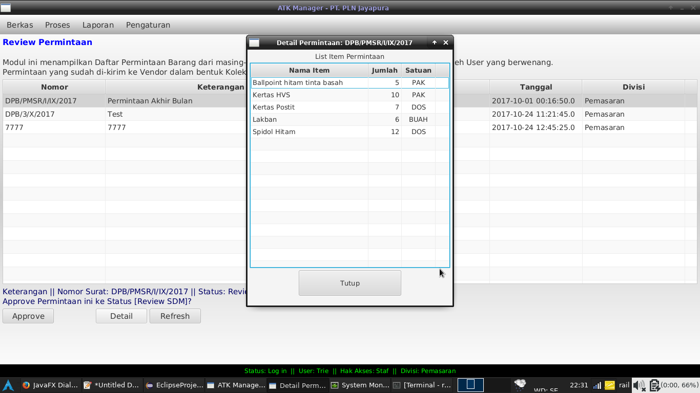
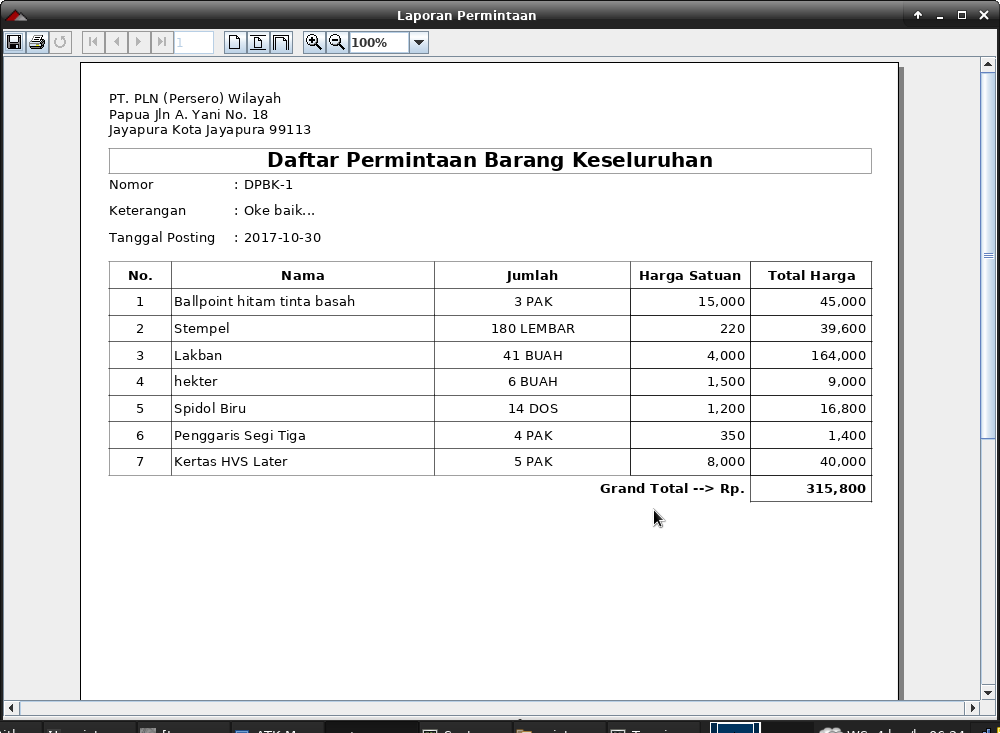
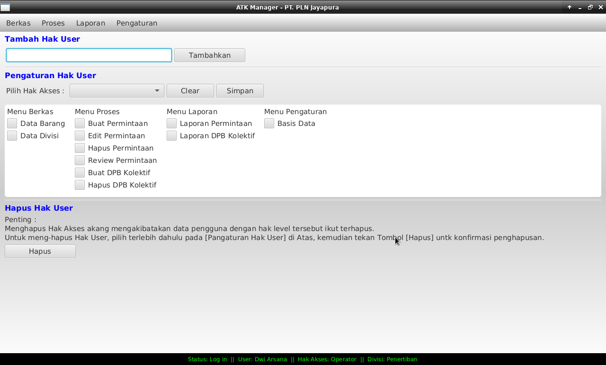
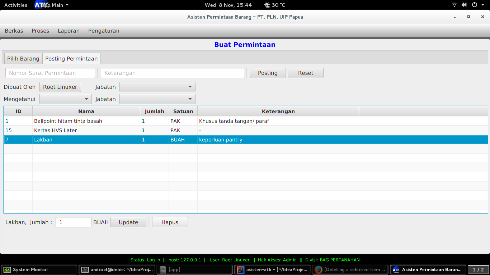
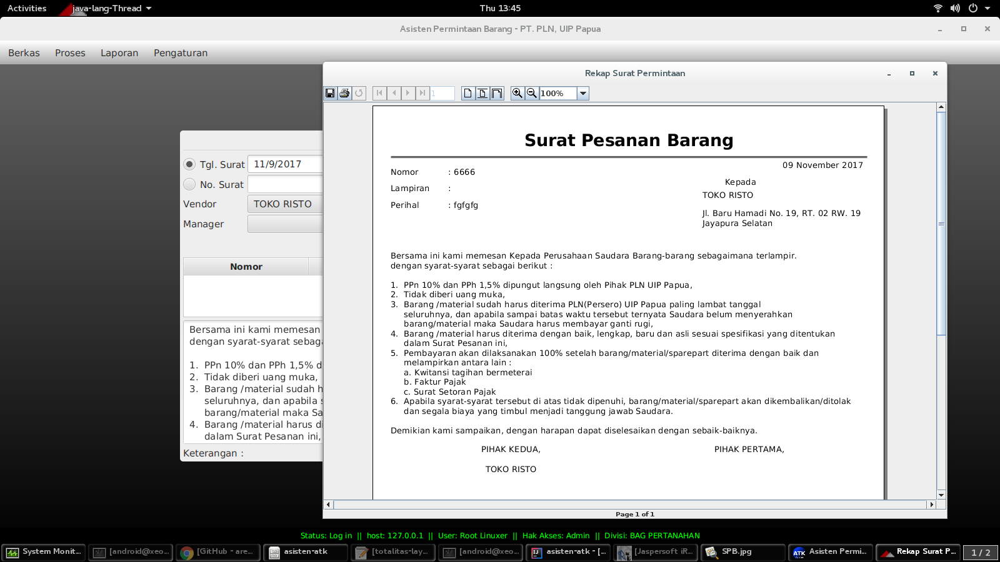
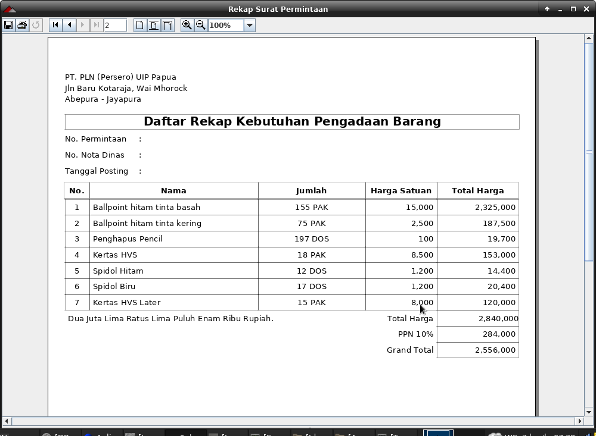
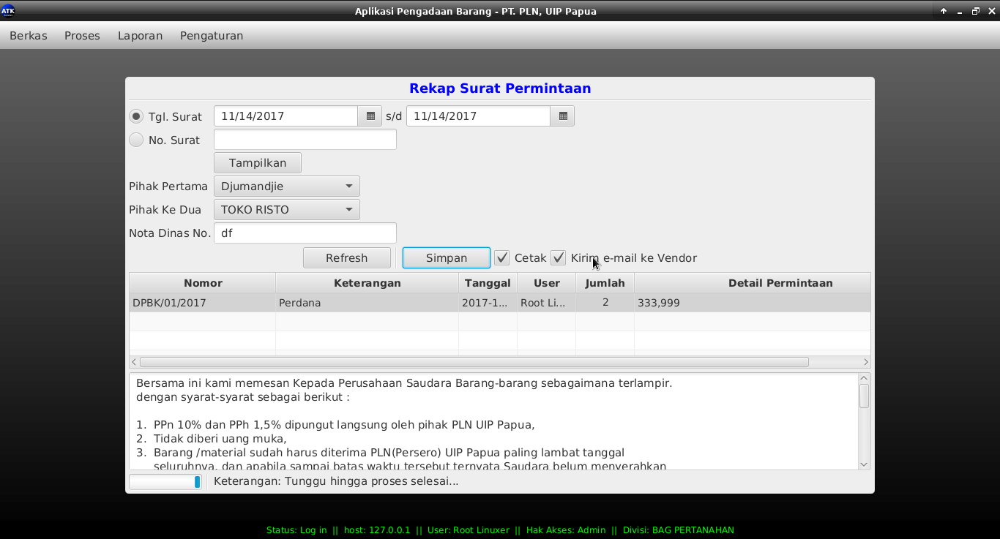

Sistem Informasi Manajemen Pengadaan Barang (SIMPERANG v.1.0)
=============================================================

## Keterangan
Aplikasi ini dibuat untuk memenuhi kebutuhan pengadaan barang dan ATK di kantor.
Beberapa fitur tambahan menyesuaikan dengan kebutuhan identik dan struktur organisasi yang ada.

> Update pertama

> Update ke-dua
Migrasi dari Eclipse ke Intellij

> Update ke-tiga
Finishing laporan kolektif

>Update ke-4
Finishing Pengaturan Hak Akses

>Update ke-5
Update fitur hapus item pada modul Pilih Barang

>Update ke-6
Update modul Vendor, tambah nama pemilik beserta report

>Update ke-7
Penambahan fungsi terbilang ke report

>Update ke-8
Fungsi combo->Simpan, cetak, kirim email ke vendor fixed.

